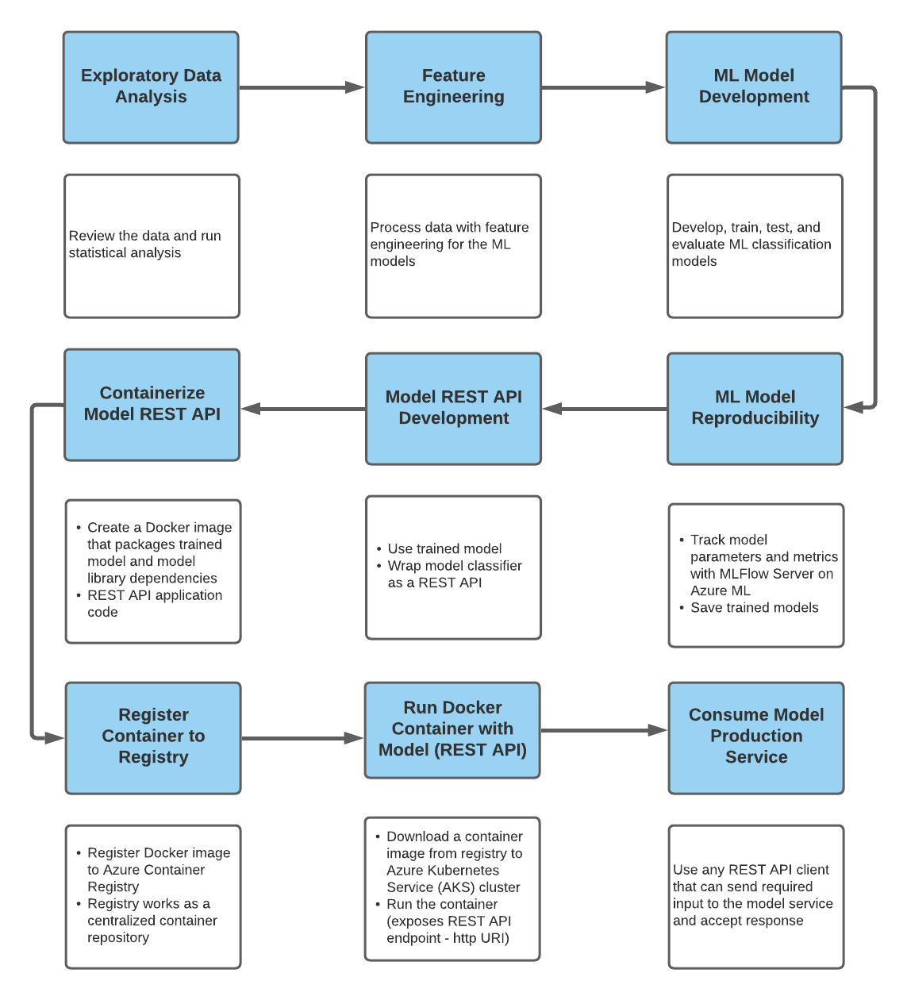

# <b>Bank Marketing Classification with a Machine Learning Model Deployed as a Web Service</b>

## <b>Description</b>

 

A set of classification models were developed to determine if the banking client will subscribe to
a term deposit. After exploratory data analysis, the models were trained and tested. Additionally,
the experiments and runs were captured on MLFlow Server in Azure PaaS for reproducibility.
After evaluating the Logistic Regression, Naïve Bayes, and Support-Vector Machine (SVM)
models, the SVM classification model was selected as the choice model based on its 90.75%
accuracy score. The model was wrapped as REST API which at the end of the development
would make the classifier model accessible to any user. In order to accomplish this task, the
following steps were taken as illustrated with the Figure 1:

 

Figure 1: Flow Chart of Classification Model Development

 

## <b>Getting Started</b>

 

### <b>Dependencies</b>

 

- Pandas
- Numpy
- Matplotlib
- Seaborn
- ProfileReport
- Sklearn
- Mlflow
- Workspace (Azureml)
- InteractiveLoginAuthentication (Azureml)
- Json
- Cd
- Ls
- Flask
- Request
- Swagger
- Pickle

 

### <b>Installing</b>

 

- Docker Desktop
- Kubernetes CLI

 

### <b>Development</b>

 

1. Develop classification models with Jupyter Notebook
    - Track the Experiment and Runs on MLFlow Server on Azure ML
    - Download the SVM classification model from Azure ML

2. Develop flaskAPI.py file with Flasgger for the input data to retrieve predicted
classifications

3. Start Anaconda Prompt.
   - conda activate [select appropriate environment]
   - pip install flask (in case dependency is not installed)
   - pip install swagger (in case dependency is not installed)
   - python flaskAPI.py

4) Start web browser
   - Navigate to address: http://127.0.0.1:5000/apidocs
   - Click on POST
   - Click on Try it out
   - Click on Browse
   - Select input data file to upload
   - Open Developer Tools
   - Click Execute
   - Within the Web Developer Tools, under Network Monitor, in File, click name of instance to view the Response results

5. Anaconda prompt
    View the model’s predicted classification indicated by
    “Prediction: <insert predicted value>”

6. Create Docker image
   - Create Dockerfile
   - Create requirements.txt
   - Build the Docker image
   - Run the Docker image to test
   - Repeat Step 4 with except navigate to address: http://0.0.0.0:5000/apidocs

7. Register Docker image to Azure Container Registry
   - Create Container Registry on Azure PaaS
   - Send the Docker image to the Container Registry

8. Configure the Kubernetes cluster
   - Create YAML file
   - Assign name of the deployment to the appropriate assignments
   - Assign name of the Container Registry to the “containers: image: <name of
    Container Registry>.azurecr.io/<name of the deployment> of YAML file
   - Assign port, if other different than 5000
   - Capture assigned External IP Address

9. Test the deployed classification model
- Copy the link: http://20.62.216.77:5000/apidocs
- Open browser
- Repeat Steps 4 b-h

 

### <b>Expected Results</b>

 

The classification model processed the input data and successfully provided the classification
prediction for each input with values of Yes or No.

 

### <b>Issue</b>

 

The login to the Azure PaaS was initially unsuccessful. The solution was amending the
configuration file to access the Azure ML Workspace. The modification was adding the
TenantID to the configuration file.

 

### <b>Source Control</b>

 

All of the files related to this assignment were uploaded to a remote Github repository,

Repository: https://github.com/Cesar312/BankMarketingClassification.git

### <b>Author</b>

 

Cesar Martinez

 

### <b>Version History</b>

 

- 0.1 - Initial Release

 

### <b>License</b>

 

The MIT License (MIT)

Copyright (c) 2021

Permission is hereby granted, free of charge, to any person obtaining a copy of this software and
associated documentation files (the "Software"), to deal in the Software without restriction,
including without limitation the rights to use, copy, modify, merge, publish, distribute,
sublicense, and/or sell copies of the Software, and to permit persons to whom the Software is
furnished to do so, subject to the following conditions:

The above copyright notice and this permission notice shall be included in all copies or
substantial portions of the Software.

THE SOFTWARE IS PROVIDED "AS IS", WITHOUT WARRANTY OF ANY KIND,
EXPRESS OR IMPLIED, INCLUDING BUT NOT LIMITED TO THE WARRANTIES OF
MERCHANTABILITY, FITNESS FOR A PARTICULAR PURPOSE AND
NONINFRINGEMENT. IN NO EVENT SHALL THE AUTHORS OR COPYRIGHT
HOLDERS BE LIABLE FOR ANY CLAIM, DAMAGES OR OTHER LIABILITY,
WHETHER IN AN ACTION OF CONTRACT, TORT OR OTHERWISE, ARISING FROM,
OUT OF OR IN CONNECTION WITH THE SOFTWARE OR THE USE OR OTHER
DEALINGS IN THE SOFTWARE.

 
